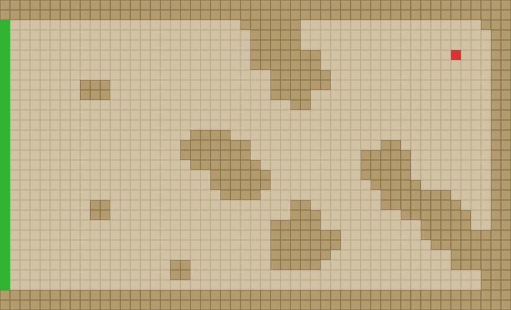

# WarZone Tower Defense — Reinforcement Learning Agent

Training a Reinforcement Learning agent to play WarZone Tower Defense Extended autonomously. The goal is to survive as many waves as possible on the Level 4 "Enclave" map.



## Project Overview

This project includes:

1. **Game Simulator** — Full recreation of WarZone Tower Defense Extended game logic (Python + Pygame)
2. **RL Environment** — Gymnasium-based RL environment with Action Masking
3. **Training Pipeline** — MaskablePPO (sb3-contrib) training system
4. **Imitation Learning** — Record human demonstrations and pretrain with Behavioral Cloning

### Map Parameters

- Map: Level 4 "Enclave" (ground units only)
- Mode: Quick Cash
- Grid: 51×31
- Enemy spawn points: 27 on the left side (x=0, y=2~28)
- Goal: (45, 5)
- Obstacles: 469 tiles
- Valid tower positions: 926 (towers occupy 2×2 tiles)
- Valid wall positions: 1,084

### Tower Types (7)

| Tower | Abbr | Cost | Description |
|-------|------|------|-------------|
| Machine Gun | MG | $200 | Fast fire rate, single target |
| Cannon | CN | $400 | Area of effect damage |
| Freezer | FR | $300 | Slows enemies |
| Sniper King | SK | $500 | Long range, high damage |
| Laser | LS | $600 | Continuous beam damage |
| Anti-Tank | AT | $1,000 | High damage vs armored |
| Plasma | PL | $800 | High DPS |

## Project Structure

```
├── simulator/          # Game engine
│   ├── game_engine.py  # Core engine: tick loop, build/upgrade/wall placement
│   ├── game_config.py  # Game config: tower stats, enemy stats, wave data
│   ├── game_map.py     # Map: obstacles, buildable positions
│   ├── towers.py       # Tower logic: attacking, upgrading, damage tracking
│   ├── enemies.py      # Enemy logic: movement, HP, path following
│   ├── pathfinding.py  # BFS pathfinding (supports dynamic wall rerouting)
│   ├── wave_controller.py # Wave spawning controller
│   └── renderer.py     # Pygame rendering
│
├── rl/                 # Reinforcement learning
│   ├── td_env.py       # Gymnasium environment (obs/action/reward)
│   ├── train.py        # MaskablePPO training script
│   ├── replay.py       # Visual replay tool
│   ├── pretrain.py     # Behavioral Cloning pretraining
│   └── record_demo.py  # Record human player demonstrations
│
├── runs/               # Training logs (one folder per run)
├── main.py             # Interactive Pygame game (for human players)
└── requirements.txt
```

## RL Environment Design

### Observation Space (3,438 dimensions)

| Component | Dims | Contents |
|-----------|------|----------|
| Global info | 15 | Cash, HP, wave number, tower/wall count, path length, etc. |
| Tower info | 200×17 = 3,400 | Position, type, level, damage dealt, efficiency per tower |
| Enemy stats | 8 | Enemy count, avg HP, nearest enemy distance, etc. |
| Wave info | 15 | Current wave enemy types and counts |

### Action Space (7,767 discrete actions + Action Masking)

| Action Type | Count | Description |
|-------------|-------|-------------|
| NOOP | 1 | Do nothing |
| BUILD | 6,482 | 7 tower types × 926 positions |
| UPGRADE | 200 | Upgrade existing towers (up to 200) |
| WALL | 1,084 | Place wall at available positions |

Action Masking ensures the agent can only select valid actions (sufficient cash, unoccupied positions, etc.).

### Reward Design (Final Version)

Final reward structure after 20 iterations:

| Reward | Value | Description |
|--------|-------|-------------|
| Kill regular enemy | +1.0 | Base kill reward |
| Kill boss | +5.0 | Boss kill bonus |
| Enemy leak | -5.0 | Regular enemy reaches goal |
| Boss leak | -20.0 | Boss reaches goal |
| Wave complete | +3.0 + wave × 0.1 | Scales with wave number |
| Upgrade tower | DPS increase × 3 | Based on actual DPS improvement |
| Wall (effective) | path increase × 0.3 | Only rewarded if wall extends enemy path |
| Wall (ineffective) | -0.3 | Penalty for useless wall placement |
| Upgrade pressure | -0.005 × upgradable count | After wave 20, penalizes not upgrading |
| Tower efficiency penalty | -0.01 | Towers with damage/investment ratio < 5 |
| Game over | -50.0 | HP reaches zero |

## Training History

Trained across **20 runs**, totaling **267.6 hours** (11.2 days) and **209 million steps**.

### Results Overview

| Run | Name | Time | Steps | Best Waves | Key Changes |
|-----|------|------|-------|------------|-------------|
| 1 | baseline | 24h | 5M | 101 | Initial version: score-based, 100-wave cap |
| 2 | survival | 8h | 5M | 117 | Switched to survival objective, removed fixed build reward |
| 3 | explore | 22h | 10M | 137 | Larger network 512×512, entropy ×3 |
| 4 | walls | 14h | 10M | ~130 | Added wall actions + tower diversity reward |
| 5 | balanced | 8h | 10M | ~125 | Reward balancing |
| 6 | survival | 3h | 4M | ~100 | Experimental, terminated early |
| 7 | unlimit | 11h | 10M | ~130 | Removed tower count limit (20→200) |
| 8 | imitation | 11h | 10M | ~120 | First imitation learning attempt |
| 9 | imitation2 | 17h | 15M | ~130 | Second imitation learning attempt |
| 10 | upgrade | 16h | 15M | ~135 | Upgrade reward tuning |
| 11 | forceupgrade | 5h | 5M | ~110 | Forced upgrade mechanism, terminated early |
| 12 | upgrade3x | 6h | 5M | ~115 | 3× upgrade reward, terminated early |
| 13 | cashpenalty | 20h | 15M | ~140 | Cash hoarding penalty |
| 14 | buildreward | 15h | 12M | ~140 | Path-coverage-based build reward |
| 15 | pathaware | 17h | 15M | ~142 | Path-aware tower placement |
| **16** | **balanced** | **19h** | **15M** | **145.7** | Comprehensive reward balancing |
| **17** | **imitation** | **11h** | **10M** | **165.6** | Behavioral Cloning + RL fine-tune |
| 18 | quality | 6h | 6M | 151.6 | Upgrade pressure + low damage penalty, degraded |
| 19 | efficiency | 1h | 0.5M | — | Efficiency reward experiment, terminated immediately |
| **20** | **fresh** | **36h** | **31M** | **155.4** | From scratch with efficiency-based rewards |

### Wave Progress

```
Run  1: ████████████████████ 101 waves (baseline)
Run  2: ███████████████████████ 117 waves
Run  3: ███████████████████████████ 137 waves
Run 16: █████████████████████████████ 145.7 waves
Run 20: ██████████████████████████████ 155.4 waves
Run 17: ████████████████████████████████ 165.6 waves ← best
Human:  ██████████████████████████████ 151 waves
```

### Key Findings

#### 1. Imitation Learning Was the Biggest Breakthrough

Run 17 used 3 human demonstrations for Behavioral Cloning pretraining, followed by RL fine-tuning. It reached 165.6 waves in just 10.8 hours, surpassing the human player (151 waves).

In contrast, pure RL (Runs 1–16) took 200+ hours to climb from 101 to 145.7 waves.

#### 2. Reward Engineering Lessons

Lessons learned over 20 iterations:
- **Removing bad rewards matters more than adding new ones**: A fixed build reward caused the agent to spam towers for points; a cash penalty caused reckless spending
- **Build-Sell exploit**: The Run 1 agent discovered it could cycle build→sell for +0.2 reward each time, ignoring enemies entirely
- **Tower homogenization**: The agent only used Machine Gun + Cannon (highest DPS/cost), even with diversity rewards
- **Refusal to upgrade**: The agent preferred building new towers over upgrading existing ones, because building gave instant reward while upgrade benefits were delayed

#### 3. Overtraining Causes Degradation

Run 20 peaked at 155.4 waves at 17.6M steps, then degraded with continued training. The policy became overconfident but brittle, with entropy continuously declining and multiple policy collapses (waves dropping below 80).

#### 4. Reward Changes Break Resumed Training

Run 18 resumed from Run 17 (165.6 waves) but with modified rewards, causing severe value function mismatch. Performance degraded from 151.6 waves steadily downward. Reward changes require training from scratch.

### Behaviors the Agent Has Not Yet Learned

- Consistently upgrading towers to max level
- Strategic wall placement to form mazes
- Late-game resource management (hoarding vs. overspending)
- Adapting defense strategy to different wave compositions

## Usage

### Installation

```bash
pip install -r requirements.txt
```

### Human Player Mode

```bash
python3 main.py
```

### Train an Agent

```bash
# Train from scratch
python3 rl/train.py train --run-name my_run --timesteps 10000000

# Resume from checkpoint
python3 rl/train.py train --run-name my_run --timesteps 10000000 --resume runs/my_run/best_wave_model

# Custom hyperparameters
python3 rl/train.py train --run-name my_run --timesteps 10000000 \
    --ent-coef 0.02 --net-size 512 --batch-size 512
```

### Record Human Demonstrations

```bash
python3 rl/record_demo.py --output demos/my_demo.npz --seed 42
```

### Behavioral Cloning Pretraining

```bash
# From scratch
python3 rl/pretrain.py --demos demos/ --epochs 50

# Fine-tune existing model
python3 rl/pretrain.py --demos demos/ --epochs 50 --resume runs/my_run/best_wave_model
```

### Replay a Model

```bash
python3 rl/replay.py --model runs/my_run/best_wave_model --seed 42
```

## Technical Details

- **Algorithm**: MaskablePPO (Proximal Policy Optimization + Action Masking)
- **Framework**: Stable-Baselines3 + sb3-contrib
- **Network**: MLP [512, 512] (separate policy and value networks)
- **Parallel envs**: 10 SubprocVecEnv workers
- **Learning rate**: 3e-4
- **Discount factor**: γ = 0.995
- **Entropy coefficient**: 0.02
- **Game time per step**: 40 ticks (2 seconds)
- **Max steps per episode**: 2,500
- **Pathfinding**: BFS (15× faster than A*, supports dynamic wall rerouting)

## License

This project is for educational and research purposes only. The original WarZone Tower Defense Extended game is the property of its respective owners.
